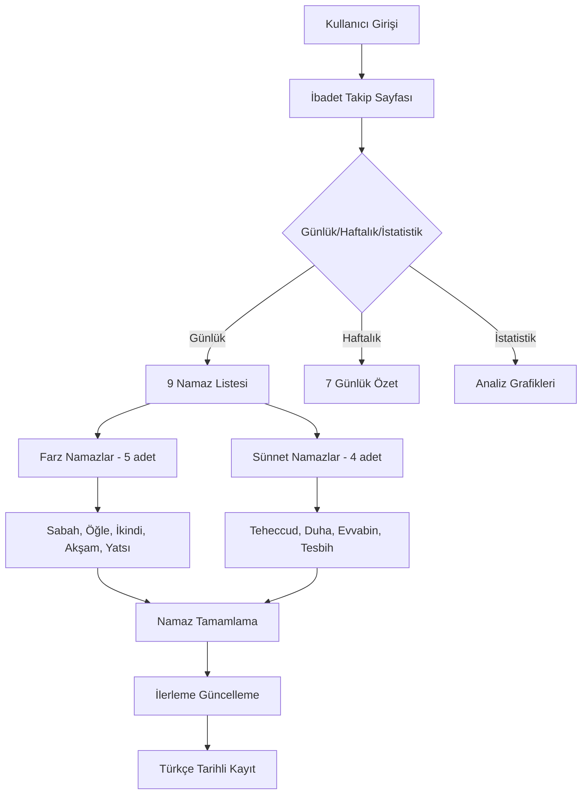
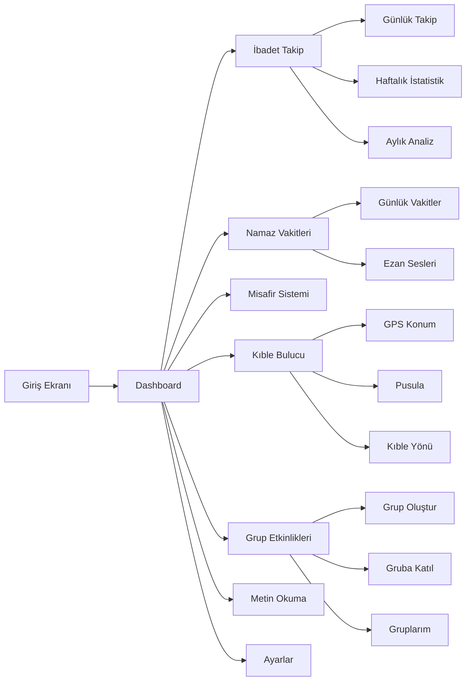
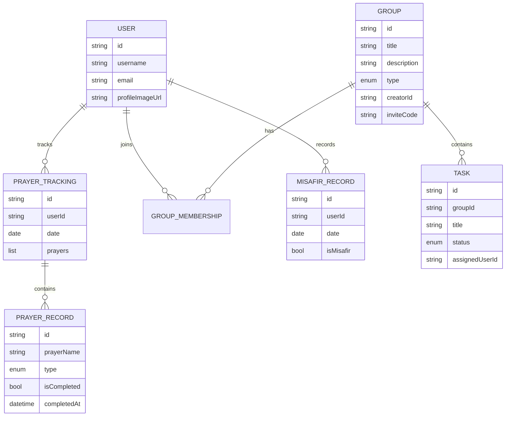

# Hayırhah - İbadet ve Dua Uygulaması

## Uygulama Hakkında

**Uygulama Adı:** Hayırhah  
**Proje Kodu:** dua_kardeslik  
**Slogan:** "Birlikte İbadet, Birlikte Sevap"  
**Platform:** Flutter (Cross-platform)  
**Dil:** Türkçe  

## Ana Özellikler

### 1. Kullanıcı Yönetimi
- **Giriş/Çıkış Sistemi:** Basit email tabanlı kimlik doğrulama
- **Profil Yönetimi:** Kullanıcı adı, email, profil fotoğrafı
- **Yerel Depolama:** In-memory storage (geliştirme aşamasında)

### 2. İbadet Takip Sistemi 📊
- **Günlük Namaz Takibi:** 5 farz namaz + sünnet namazlar
  - **Farz Namazlar:** Sabah, Öğle, İkindi, Akşam, Yatsı (vaktinde, sünnet, tesbihat takibi)
  - **Sünnet & Nafile Namazlar:** Teheccud, Duha, Evvabin, Tespih
  - **Kaza Namazları:** Kaçırılan farz namazların takibi
- **İlerleme Gösterimi:** Günlük, haftalık ve aylık istatistikler
- **Türkçe Tarih Formatları:** Tam Türkçe kullanıcı deneyimi
- **Haftalık/Aylık İstatistikler:** Detaylı analiz ve raporlama

### 3. Grup Etkinlikleri
- **Grup Oluşturma:** Çeşitli ibadet türleri için grup oluşturma
- **Grup Katılma:** Davet kodu ile gruplara katılma
- **Grup Yönetimi:** Grup bilgilerini düzenleme, üye ekleme

### 4. İbadet Türleri

#### Hazır Şablonlar:
- **Hatim:** Kur'an-ı Kerim'i 30 cüzde tamamlama (30 görev)
- **Yasin Suresi:** 41 defa Yasin Suresi okuma (41 görev)
- **Fetih Suresi:** 19 defa Fetih Suresi okuma (19 görev)
- **Salât-ı Tefriciye:** 4444 defa Salât-ı Tefriciye okuma (4444 görev)

#### Özel Görevler:
- **Özel Bölümlü Görev:** Kullanıcı tanımlı bölümlü görevler
- **Özel Sayılı Görev:** Kullanıcı tanımlı sayılı görevler

### 5. Görev Yönetimi
- **Görev Atama:** Grup üyelerine görev atama
- **İlerleme Takibi:** Gerçek zamanlı ilerleme izleme
- **Durum Yönetimi:** Görev durumları (müsait, atandı, tamamlandı)
- **Otomatik Güncelleme:** Grup ilerlemesinin otomatik hesaplanması

### 6. Metin Görüntüleme
- **Arapça Metin Görüntüleme:** Yasin, Fetih, Salât-ı Tefriciye
- **Sayfa Tabanlı Gösterim:** Görsel sayfa sistemi
- **Yakınlaştırma/Uzaklaştırma:** Metin boyutu ayarlama
- **Sayfa İşaretleme:** Önemli sayfaları işaretleme
- **Paylaşım:** Metin ve sayfa paylaşımı

### 7. Kıble Bulucu 🧭
- **GPS Tabanlı Konum:** Gerçek zamanlı konum algılama
- **Pusula Entegrasyonu:** Cihaz pusula sensörü kullanımı
- **Kıble Yönü Hesaplama:** Haversine formülü ile hassas hesaplama
- **Basitleştirilmiş Konum Bilgisi:** Sadece şehir ve ülke bilgisi gösterimi
- **Görsel Pusula:** Kuzey-Güney-Doğu-Batı işaretli pusula
- **Gelişmiş Kıble Oku:** 
  - Büyük ve belirgin yeşil ok (40x40 daire başlık)
  - Beyaz ok ikonu ve yeşil kenarlık
  - Kalın ok gövdesi (8px genişlik, 80px yükseklik)
  - Kabe emojisi (🕌) ok ucunda
  - Parıltı ve gölge efektleri
  - Küçük yeşil nokta göstergesi
- **Konum Yenileme:** Manuel konum güncelleme özelliği
- **İzin Yönetimi:** Konum ve sensör izinleri yönetimi

### 8. Namaz Vakitleri ⏰
- **Günlük Namaz Vakitleri:** 5 vakit namaz saatleri
- **Türkçe Tarih Formatları:** Tam yerelleştirme
- **Konum Tabanlı:** GPS ile otomatik konum belirleme
- **Ezanlar:** Farklı ezan sesleri seçenekleri


- **Basit Arayüz:** Kolay kullanım

### 10. Sosyal Özellikler
- **Davet Sistemi:** 6 haneli davet kodları
- **Grup Paylaşımı:** Grup bilgilerini paylaşma
- **İlerleme Paylaşımı:** Başarıları paylaşma

### 11. Kullanıcı Deneyimi
- **Modern Tasarım:** Material Design 3 
- **Koyu Tema:** İslami karaktere uygun koyu renk paleti
- **Responsive UI:** Farklı ekran boyutları için uyumlu tasarım
- **Boş Durum Ekranları:** Kullanıcı dostu boş durum tasarımları
- **Yeniden Tasarlanmış Dashboard:** Temiz ve odaklanmış ana ekran

## Teknik Özellikler

### Framework & Teknolojiler
- **Flutter:** ^3.6.2
- **Dart:** ^3.6.2
- **Material Design 3:** Modern UI tasarımı

### Bağımlılıklar
- **cupertino_icons:** ^1.0.8 (iOS stil ikonlar)
- **qr_flutter:** ^4.1.0 (QR kod oluşturma)
- **share_plus:** ^11.0.0 (İçerik paylaşımı)
- **geolocator:** ^10.1.0 (GPS konum servisleri)
- **flutter_compass:** ^0.8.0 (Pusula sensörü)
- **permission_handler:** ^11.1.0 (İzin yönetimi)
- **geocoding:** ^3.0.0 (Konum-adres dönüşümü)
- **intl:** Türkçe tarih formatları
- **shared_preferences:** Veri depolama

### Veri Yapısı
- **User Model:** Kullanıcı bilgileri
- **Group Model:** Grup bilgileri ve ayarları
- **Task Model:** Görev bilgileri ve durumu
- **ArabicText Model:** Arapça metin ve sayfa yapısı
- **PrayerTracking Model:** Namaz takip sistemi
- **PrayerTimes Model:** Namaz vakitleri


### Veri Depolama
- **SharedPreferences:** Kalıcı veri depolama
- **StorageService:** Merkezi veri yönetimi servisi
- **PrayerTrackingService:** İbadet takip servisi
- **PrayerTimesService:** Namaz vakitleri servisi

### Platform Yapılandırması
- **Android:** Konum izinleri (AndroidManifest.xml)
- **iOS:** Konum kullanım açıklamaları (Info.plist)
- **Sensör Desteği:** GPS, Pusula, Geocoding

## Dosya Yapısı

```
lib/
├── main.dart                    # Ana uygulama giriş noktası
├── models/                      # Veri modelleri
│   ├── user.dart               # Kullanıcı modeli
│   ├── group.dart              # Grup modeli
│   ├── task.dart               # Görev modeli
│   ├── arabic_text.dart        # Arapça metin modeli
│   ├── prayer_tracking.dart    # İbadet takip modeli
│   ├── prayer_times.dart       # Namaz vakitleri modeli
│   ├── misafir.dart           # Misafir modeli
│   └── notification_preferences.dart # Bildirim ayarları
├── screens/                     # Ekran widget'ları
│   ├── auth/
│   │   └── login_screen.dart   # Giriş ekranı
│   ├── dashboard/
│   │   └── dashboard_screen.dart # Ana panel
│   ├── group/
│   │   ├── create_group_screen.dart # Grup oluşturma
│   │   ├── group_detail_screen.dart # Grup detayları
│   │   └── my_groups_screen.dart # Gruplarım
│   ├── invite/
│   │   └── join_group_screen.dart # Gruba katılma
│   ├── prayer_tracking/
│   │   └── ibadet_takip_screen.dart # İbadet takip (YENİ)
│   ├── prayer/
│   │   └── prayer_times_screen.dart # Namaz vakitleri (YENİ)
│   ├── misafir/
│   │   └── misafir_screen.dart # Misafir sistemi (YENİ)
│   ├── qibla/
│   │   └── qibla_finder_screen.dart # Kıble bulucu
│   ├── settings/
│   │   └── settings_screen.dart # Ayarlar (YENİ)
│   └── text/
│       └── arabic_text_viewer_screen.dart # Metin görüntüleme
└── services/
    ├── storage_service.dart     # Veri depolama servisi
    ├── prayer_tracking_service.dart # İbadet takip servisi
    ├── prayer_times_service.dart # Namaz vakitleri servisi
    ├── misafir_service.dart    # Misafir servisi
    ├── notification_service.dart # Bildirim servisi
    └── theme_service.dart      # Tema servisi
```

## Dashboard Yeniden Tasarımı

### Ana Özellikler (Büyük Kartlar):
1. **📿 İbadet Takip:** Namaz takibi ve istatistikler
2. **⏰ Namaz Vakitleri:** Günlük namaz saatleri
3. **🏠 Misafir:** Misafir durumu kayıtları
4. **🔵 Etkinlik Oluştur:** Dua grubu oluşturma ve yönetme
5. **🟢 Kıble Bulucu:** Namaz yönü bulma ve pusula

### Diğer Özellikler:
- **Gruba Katıl:** QR kod ile grup katılımı
- **Metin Okuma:** Yasin, Fetih, Tefriciye metinleri
- **Ayarlar:** Uygulama ayarları ve tema

### Tasarım Değişiklikleri:
- Kolay erişim bölümü kaldırıldı
- Ana özellikler vurgulandı
- Temiz ve odaklanmış arayüz
- Gelecek özellikler için genişletilebilir yapı

## Geliştirme Notları

### Geliştirilmesi Gereken Özellikler:
1. **Veritabanı Entegrasyonu:** Firebase/Supabase entegrasyonu
2. **Kullanıcı Kimlik Doğrulama:** Güvenli giriş sistemi
3. **Bildirim Sistemi:** Push notifications
4. **Offline Mod:** İnternet bağlantısı olmadan çalışma
5. **Ses Desteği:** Arapça metinler için ses dosyaları
6. **Gelişmiş İstatistikler:** Grafikli analiz sayfaları
7. **Tesbih Sayacı:** Dijital tesbih özelliği
8. **Dua Koleksiyonu:** Günlük dualar ve zikirler
9. **Hatırlatıcılar:** Namaz ve ibadet hatırlatmaları
10. **Sosyal Özellikler:** Arkadaş sistemi ve paylaşımlar

### Mevcut Sınırlamalar:
- Veriler yerel olarak saklanıyor (SharedPreferences)
- Basit kimlik doğrulama sistemi
- Sınırlı hata yönetimi
- Kıble bulucu gerçek cihazda test edilmeli
- Namaz vakitleri hesaplaması geliştirilmeli

## Kullanım Akışı

1. **Uygulama Başlatma:** Login ekranından giriş
2. **Dashboard:** Ana ekran ile özellik seçimi
3. **İbadet Takip:** Günlük namaz takibi ve istatistikler
4. **Namaz Vakitleri:** Günlük namaz saatlerini görüntüleme
5. **Grup Oluşturma:** Yeni ibadet grupları oluşturma
6. **Grup Katılma:** Davet kodu ile gruplara katılma
7. **Görev Alma:** Grup içinde görev seçimi
8. **İlerleme Takibi:** Grup ve kişisel ilerleme izleme
9. **Metin Okuma:** Arapça metinleri görüntüleme ve okuma
10. **Kıble Bulma:** GPS ve pusula ile kıble yönü belirleme

## Özellik Diyagramları

### İbadet Takip Sistemi Akışı


### Uygulama Ana Akışı


### Veri Modeli İlişkileri


## Güncelleme Geçmişi

- **v1.0.0:** İlk sürüm - Temel özellikler
- **v1.0.1:** 
  - Grup detaylarına direkt erişim (teyit mesajı kaldırıldı)
  - Arapça metin görüntüleme sorunları düzeltildi
  - Logo hata yönetimi eklendi
  - Yasin ve Fetih ikonları dashboard'a eklendi
- **v1.1.0:** 
  - **Kıble Bulucu Özelliği:** GPS tabanlı kıble yönü bulma
  - **Pusula Entegrasyonu:** Gerçek zamanlı pusula desteği
  - **Dashboard Yeniden Tasarımı:** Temiz ve odaklanmış arayüz
- **v1.2.0:** 
  - **İbadet Takip Sistemi:** 9 namaz takibi (5 farz + 4 sünnet)
  - **Namaz Vakitleri:** Günlük namaz saatleri ve ezan sesleri
  - **Misafir Sistemi:** Günlük misafir durumu kayıtları
  - **Türkçe Yerelleştirme:** Tam Türkçe tarih formatları
  - **Ayarlar Sayfası:** Uygulama ayarları ve tema yönetimi
  - **Uygulama Adı Değişikliği:** "Dua Kardeşliği" → "Hayırhah"
  - **SharedPreferences:** Kalıcı veri depolama sistemi
- **Sonraki Sürümler:** Bu dosya geliştirme sürecinde güncellenecek

---

*Bu dosya, uygulama geliştirildikçe düzenli olarak güncellenecektir.* 